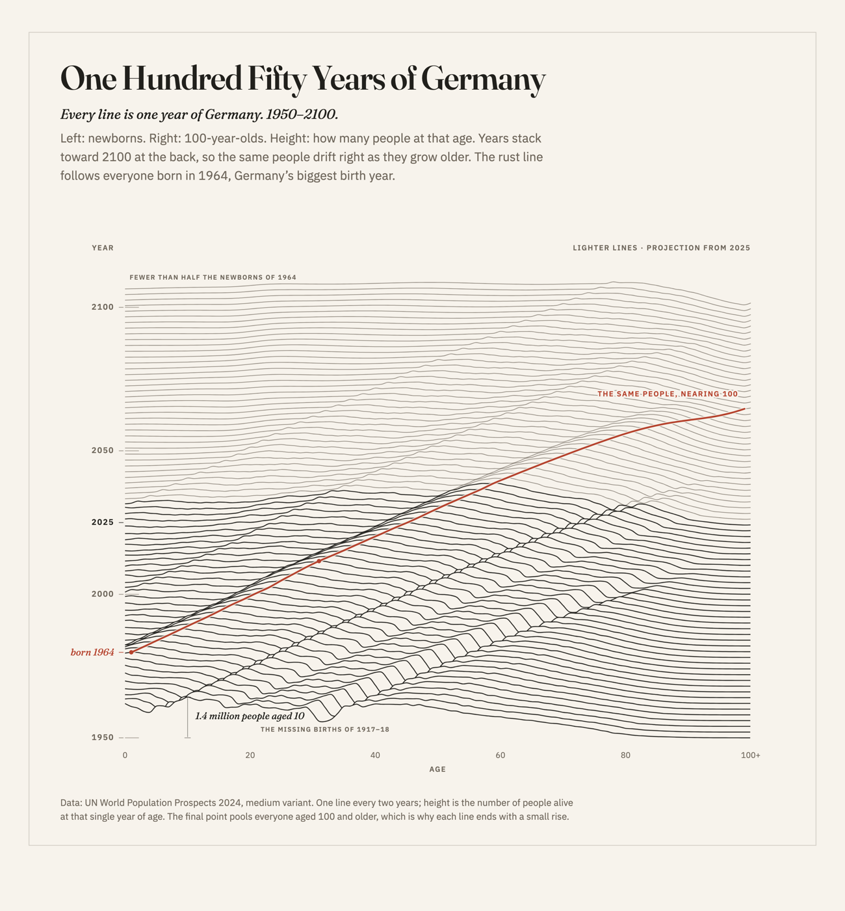
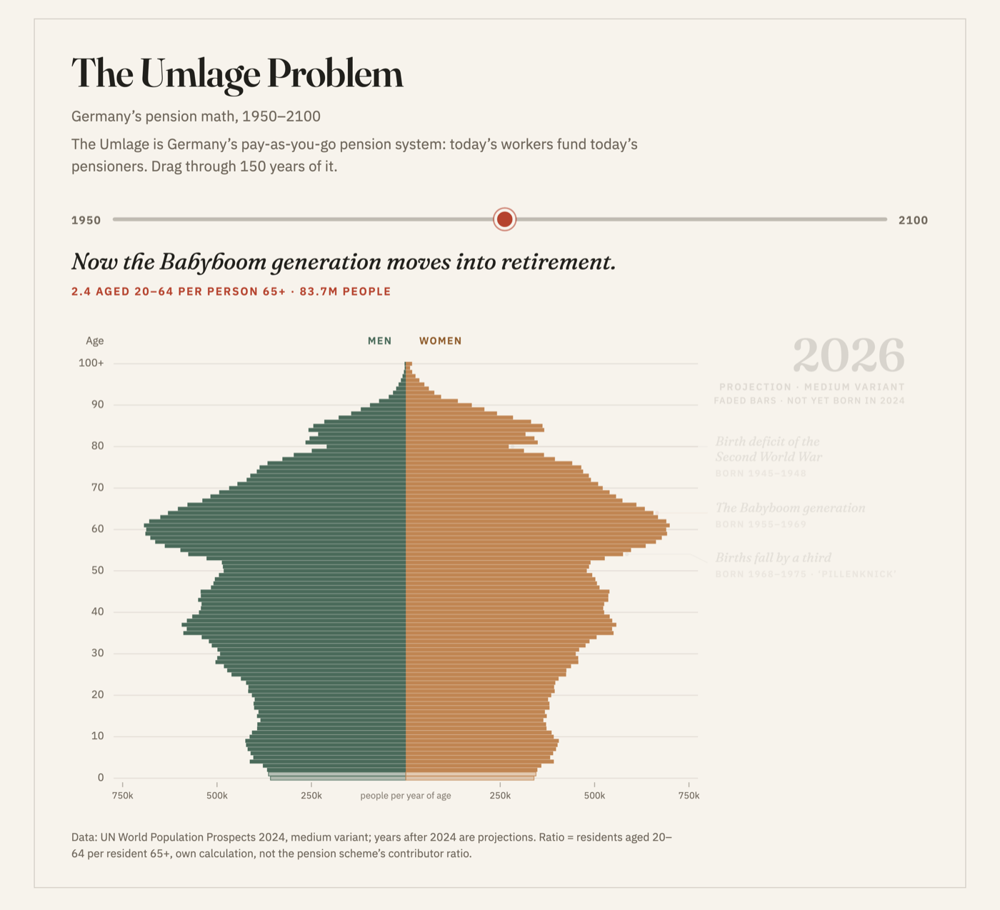

# The Umlage Problem

Germany's population from 1950 to 2100, drawn a few different ways. Same data every time: UN World Population Prospects 2024.

## Open it

- [The population pyramid](https://chiragsomashekar.github.io/umlage-problem/) with a slider. Drag through 150 years.
- [The ridgeline poster](https://chiragsomashekar.github.io/umlage-problem/?ridge). One line for every second year. The red line follows everyone born in 1964.
- [The ridgeline as a short video](https://chiragsomashekar.github.io/umlage-problem/?reel)
- [The pyramid as a short video](https://chiragsomashekar.github.io/umlage-problem/?promo)
- [An experiment](https://chiragsomashekar.github.io/umlage-problem/?flow), not finished.

## Good to know

- Years after 2024 are projections.
- The ratio on the main page is people aged 20 to 64 per person aged 65 or older. I calculated it from the population numbers. It is not the official pension contributor ratio.
- The last age group is 100 and older, all in one bucket. That is why every line ends with a small bump.

## Built with

React, D3 and Motion. D3 does the math, React draws the SVG, Motion animates it.

## Data

United Nations, World Population Prospects 2024, medium variant.
